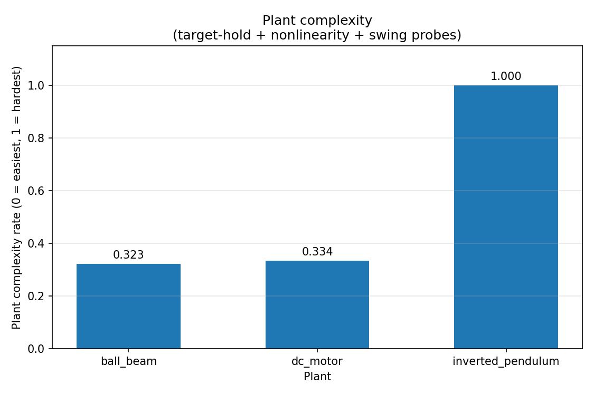
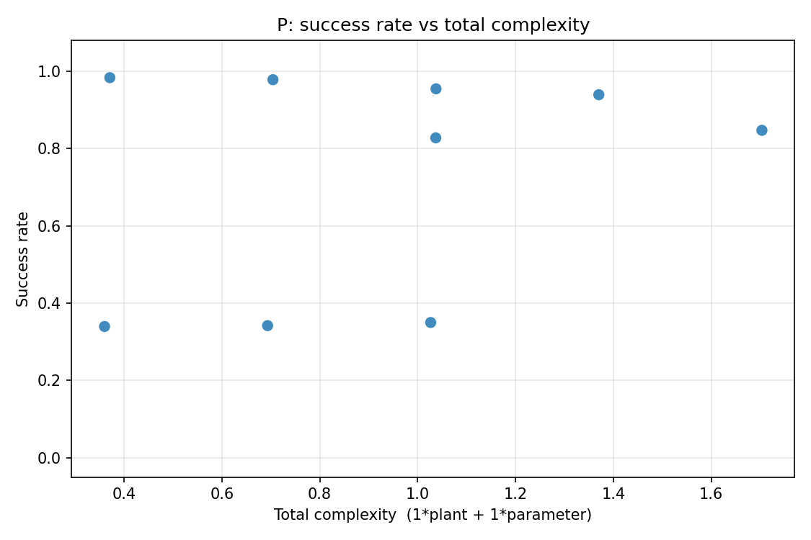
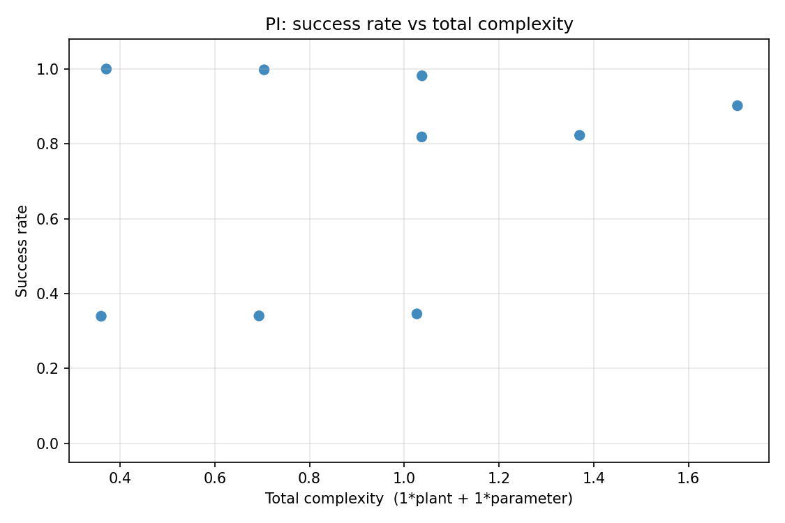
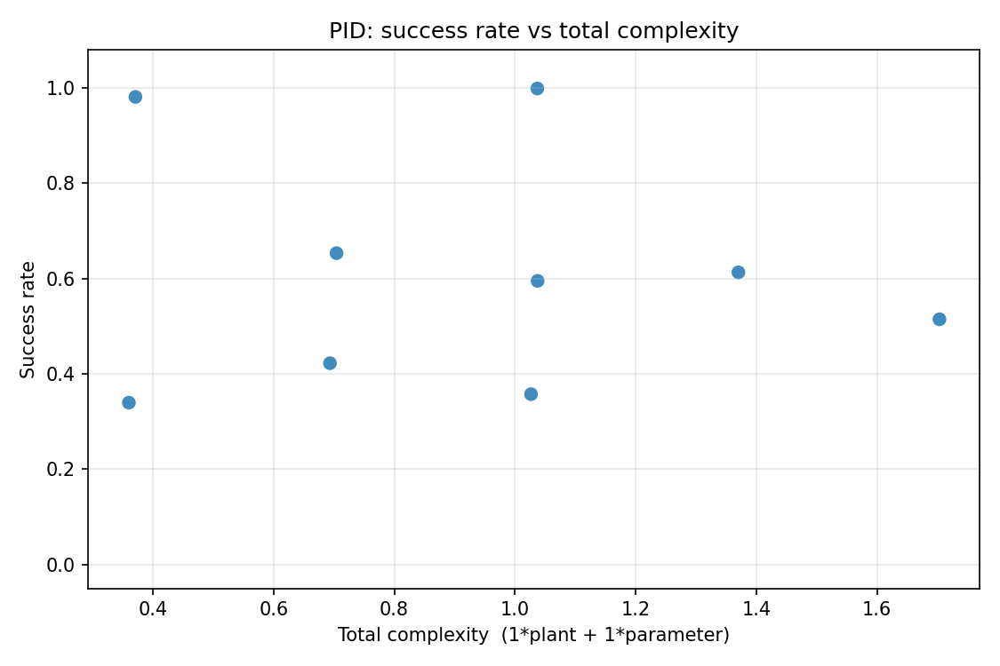
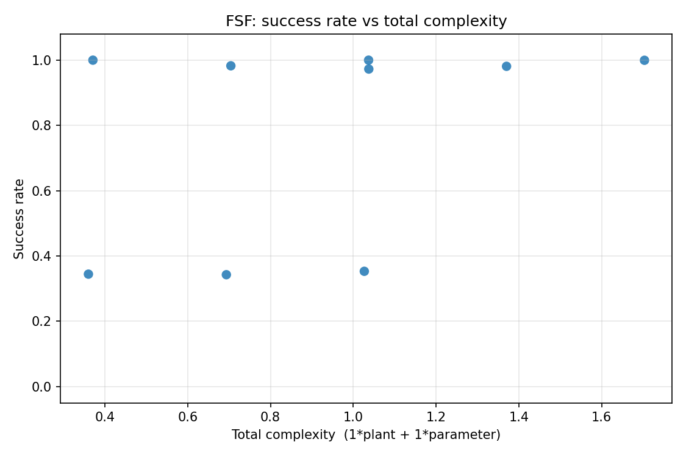

# SiLo Benchmark Progress Report

## 1. Sanity Check

_Generated: 2026-08-21T19:59:32 · Wall time: 3.08s_

**Pass rate: 100.0%** — 49 passed, 0 failed, 0 skipped, 1 xfailed (known gaps), 0 xpassed, 50 total.

| Category | Passed | Failed | Skipped | XFail | XPass |
|---|---|---|---|---|---|
| unit | 25 | 0 | 0 | 0 | 0 |
| simulate | 3 | 0 | 0 | 0 | 0 |
| scenario | 1 | 0 | 0 | 0 | 0 |
| design | 8 | 0 | 0 | 1 | 0 |
| randomness | 2 | 0 | 0 | 0 | 0 |
| failure | 8 | 0 | 0 | 0 | 0 |
| fixtures | 2 | 0 | 0 | 0 | 0 |

**Baseline** — 2026-08-21T19:55:11 · pass-rate delta 0.0%.

## 2. Randomness Tests

Both experiments drive the full mock design pipeline and record the last-iteration metrics. Mean/variance are taken over the samples; the success rate uses the shared definition applied to the mean steady-state error.

| Experiment | Samples | MSE mean | MSE var | RMSE mean | RMSE var | SSE mean | SSE var | **success rate** |
|---|---|---|---|---|---|---|---|---|
| Same config, different seeds | 15 | 5.3504 | 47.6176 | 1.9699 | 1.4698 | 2.5725 | 10.5435 | **0.5591** |
| Repeated runs (same seed) | 3 | 2.9724 | 0.7435 | 1.7032 | 0.0714 | 2.4900 | 1.1330 | **0.5628** |

- **Same config, different seeds** — Drives run_optimization on each built-in plant under a fixed 'medium' scenario (IC=[0.5, 0.5], randomness_level=0.5, disturbance_level=0.2) with PID and max_iter=5, over seeds [1, 7, 42, 100, 2026]. Last-iteration metrics are aggregated over all plants x seeds.
- **Repeated runs (same seed)** — Same 'medium' scenario, PID and max_iter=5, but a single fixed seed (42) run 5 times per plant; only the last run's metrics are recorded per plant (the design 'seed' does not reseed the mock agents' gain RNG, so repeats differ). Values aggregate the recorded last runs across the plants.

_Per-plant / per-seed raw metrics stay in `latest_results/test_randomness_report.json`._

## 3. Scenario Tests

Design-path sweep over every built-in plant x 3 scenarios (easy/mid/hard, given as initial position / disturbance_level / randomness_level = 0.5/0.0/0.0, 0.5/0.5/0.5, 0.5/1.0/1.0) x 4 controllers (P, PI, PID, FSF) with a single gain range [0, 100] = 36 runs. Each record is the last-iteration outcome of one run_optimization run. Controller families are selected via matching param_ranges keys (P->Kp, PI->Kp/Ki, PID->Kp/Ki/Kd, FSF->K1..Kn). The target is 0.0 and the initial position is fixed at 0.5, so initial_error is 0.5 for every run. Derived complexity and success rate are computed by reports/make_report.py.

### 3.1 Methodology

**Plant complexity (0..1)** — three open-loop probes (`reports/plant_complexity.py`), min-max normalized across the plants and blended with equal weights:

1. *target-hold* — start on a non-zero target with the controller off; score = mean normalized distance drifted away from it.
2. *nonlinearity* — apply a constant control and test homogeneity: for a linear plant `sim(a*x0, a*u) == a*sim(x0, u)`; score = mean relative deviation.
3. *swing* — sit on the target, apply a small control action, and count the output's direction reversals (oscillations).

**Parameter complexity (0..1)** — weighted blend of each run's user-input parameters, mapped to 0..1 against fixed reference scales so the value stays comparable between archived reports:

| Term | Weight | Reference (maps to 1.0) |
|---|---|---|
| randomness_level | 0.3333 | 1.0 |
| disturbance_level | 0.3333 | 1.0 |
| num_states | 0.3333 | 10 |

**Total complexity** = 1 x plant + 1 x parameter.

**Success rate** (`SUCCESS_MODE = "log"`) — bounded score in (0, 1] from `r = ss_error / initial_error`:

```
success = 1 / (1 + log10(1 + r))
```

The log scale is deliberate: a plain `exp(-r)` underflows to exactly 0 once `r` is large (the saturating ball_beam runs reach `r ~ 87`), which makes all bad runs indistinguishable. Reference points: `r=0 -> 1.000`, `r=1 -> 0.768`, `r=9 -> 0.500`, `r=87 -> 0.340`, `r=1e44 -> 0.022`.

### 3.2 Plant Complexity

| Plant | hold (raw) | nonlin. (raw) | swing (raw) | hold | nonlin. | swing | #states | **complexity** |
|---|---|---|---|---|---|---|---|---|
| ball_beam | 0.0000 | 0.4947 | 0.0 | 0.00 | 0.97 | 0.00 | 2 | **0.323** |
| dc_motor | 0.5948 | 0.0000 | 0.7 | 0.67 | 0.00 | 0.33 | 2 | **0.334** |
| inverted_pendulum | 0.8902 | 0.5105 | 2.0 | 1.00 | 1.00 | 1.00 | 2 | **1.000** |



### 3.3 Parameter Complexity

`num_states` is a plant property, so the score is listed per (plant, scenario) pair.

| Plant | Scenario | randomness | disturbance | #states | **parameter complexity** |
|---|---|---|---|---|---|
| ball_beam | easy | 0.00 | 0.00 | 2 | **0.0370** |
| dc_motor | easy | 0.00 | 0.00 | 2 | **0.0370** |
| inverted_pendulum | easy | 0.00 | 0.00 | 2 | **0.0370** |
| ball_beam | mid | 0.50 | 0.50 | 2 | **0.3704** |
| dc_motor | mid | 0.50 | 0.50 | 2 | **0.3704** |
| inverted_pendulum | mid | 0.50 | 0.50 | 2 | **0.3704** |
| ball_beam | hard | 1.00 | 1.00 | 2 | **0.7037** |
| dc_motor | hard | 1.00 | 1.00 | 2 | **0.7037** |
| inverted_pendulum | hard | 1.00 | 1.00 | 2 | **0.7037** |

### 3.4 Controller P

| Plant | Scenario | plant cx | param cx | **total cx** | ss_error | initial error | r | **success rate** | stable |
|---|---|---|---|---|---|---|---|---|---|
| ball_beam | easy | 0.323 | 0.0370 | **0.3600** | 43.5003 | 0.50 | 87.00 | **0.3396** | False |
| dc_motor | easy | 0.334 | 0.0370 | **0.3709** | 0.0199 | 0.50 | 0.04 | **0.9834** | False |
| ball_beam | mid | 0.323 | 0.3704 | **0.6933** | 41.6508 | 0.50 | 83.30 | **0.3418** | False |
| dc_motor | mid | 0.334 | 0.3704 | **0.7042** | 0.0264 | 0.50 | 0.05 | **0.9781** | False |
| ball_beam | hard | 0.323 | 0.7037 | **1.0267** | 35.5534 | 0.50 | 71.11 | **0.3499** | False |
| inverted_pendulum | easy | 1.000 | 0.0370 | **1.0370** | 0.3077 | 0.50 | 0.62 | **0.8276** | False |
| dc_motor | hard | 0.334 | 0.7037 | **1.0375** | 0.0580 | 0.50 | 0.12 | **0.9545** | False |
| inverted_pendulum | mid | 1.000 | 0.3704 | **1.3704** | 0.0803 | 0.50 | 0.16 | **0.9393** | False |
| inverted_pendulum | hard | 1.000 | 0.7037 | **1.7037** | 0.2576 | 0.50 | 0.52 | **0.8471** | False |



### 3.5 Controller PI

| Plant | Scenario | plant cx | param cx | **total cx** | ss_error | initial error | r | **success rate** | stable |
|---|---|---|---|---|---|---|---|---|---|
| ball_beam | easy | 0.323 | 0.0370 | **0.3600** | 43.5003 | 0.50 | 87.00 | **0.3396** | False |
| dc_motor | easy | 0.334 | 0.0370 | **0.3709** | 0.0000 | 0.50 | 0.00 | **1.0000** | False |
| ball_beam | mid | 0.323 | 0.3704 | **0.6933** | 42.6915 | 0.50 | 85.38 | **0.3406** | False |
| dc_motor | mid | 0.334 | 0.3704 | **0.7042** | 0.0025 | 0.50 | 0.00 | **0.9979** | False |
| ball_beam | hard | 0.323 | 0.7037 | **1.0267** | 38.4750 | 0.50 | 76.95 | **0.3458** | False |
| inverted_pendulum | easy | 1.000 | 0.0370 | **1.0370** | 0.3328 | 0.50 | 0.67 | **0.8186** | False |
| dc_motor | hard | 0.334 | 0.7037 | **1.0375** | 0.0217 | 0.50 | 0.04 | **0.9819** | False |
| inverted_pendulum | mid | 1.000 | 0.3704 | **1.3704** | 0.3209 | 0.50 | 0.64 | **0.8228** | False |
| inverted_pendulum | hard | 1.000 | 0.7037 | **1.7037** | 0.1422 | 0.50 | 0.28 | **0.9019** | False |



### 3.6 Controller PID

| Plant | Scenario | plant cx | param cx | **total cx** | ss_error | initial error | r | **success rate** | stable |
|---|---|---|---|---|---|---|---|---|---|
| ball_beam | easy | 0.323 | 0.0370 | **0.3600** | 43.5003 | 0.50 | 87.00 | **0.3396** | False |
| dc_motor | easy | 0.334 | 0.0370 | **0.3709** | 0.0228 | 0.50 | 0.05 | **0.9810** | False |
| ball_beam | mid | 0.323 | 0.3704 | **0.6933** | 11.1589 | 0.50 | 22.32 | **0.4224** | False |
| dc_motor | mid | 0.334 | 0.3704 | **0.7042** | 1.1974 | 0.50 | 2.39 | **0.6532** | False |
| ball_beam | hard | 0.323 | 0.7037 | **1.0267** | 30.8967 | 0.50 | 61.79 | **0.3574** | False |
| inverted_pendulum | easy | 1.000 | 0.0370 | **1.0370** | 0.0016 | 0.50 | 0.00 | **0.9986** | True |
| dc_motor | hard | 0.334 | 0.7037 | **1.0375** | 1.8950 | 0.50 | 3.79 | **0.5951** | False |
| inverted_pendulum | mid | 1.000 | 0.3704 | **1.3704** | 1.6396 | 0.50 | 3.28 | **0.6130** | False |
| inverted_pendulum | hard | 1.000 | 0.7037 | **1.7037** | 3.8909 | 0.50 | 7.78 | **0.5145** | False |



### 3.7 Controller FSF

| Plant | Scenario | plant cx | param cx | **total cx** | ss_error | initial error | r | **success rate** | stable |
|---|---|---|---|---|---|---|---|---|---|
| ball_beam | easy | 0.323 | 0.0370 | **0.3600** | 39.6085 | 0.50 | 79.22 | **0.3443** | False |
| dc_motor | easy | 0.334 | 0.0370 | **0.3709** | 0.0000 | 0.50 | 0.00 | **1.0000** | False |
| ball_beam | mid | 0.323 | 0.3704 | **0.6933** | 40.9348 | 0.50 | 81.87 | **0.3427** | False |
| dc_motor | mid | 0.334 | 0.3704 | **0.7042** | 0.0207 | 0.50 | 0.04 | **0.9827** | False |
| ball_beam | hard | 0.323 | 0.7037 | **1.0267** | 33.4959 | 0.50 | 66.99 | **0.3530** | False |
| inverted_pendulum | easy | 1.000 | 0.0370 | **1.0370** | 0.0000 | 0.50 | 0.00 | **1.0000** | True |
| dc_motor | hard | 0.334 | 0.7037 | **1.0375** | 0.0333 | 0.50 | 0.07 | **0.9728** | False |
| inverted_pendulum | mid | 1.000 | 0.3704 | **1.3704** | 0.0226 | 0.50 | 0.05 | **0.9812** | False |
| inverted_pendulum | hard | 1.000 | 0.7037 | **1.7037** | 0.0004 | 0.50 | 0.00 | **0.9996** | False |


