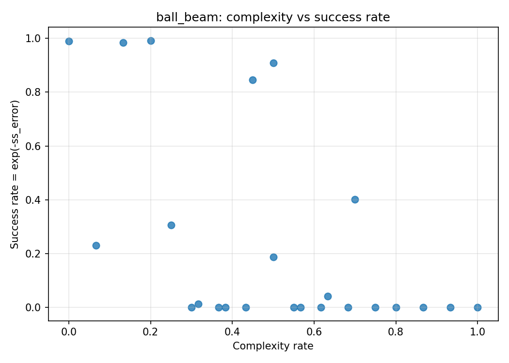
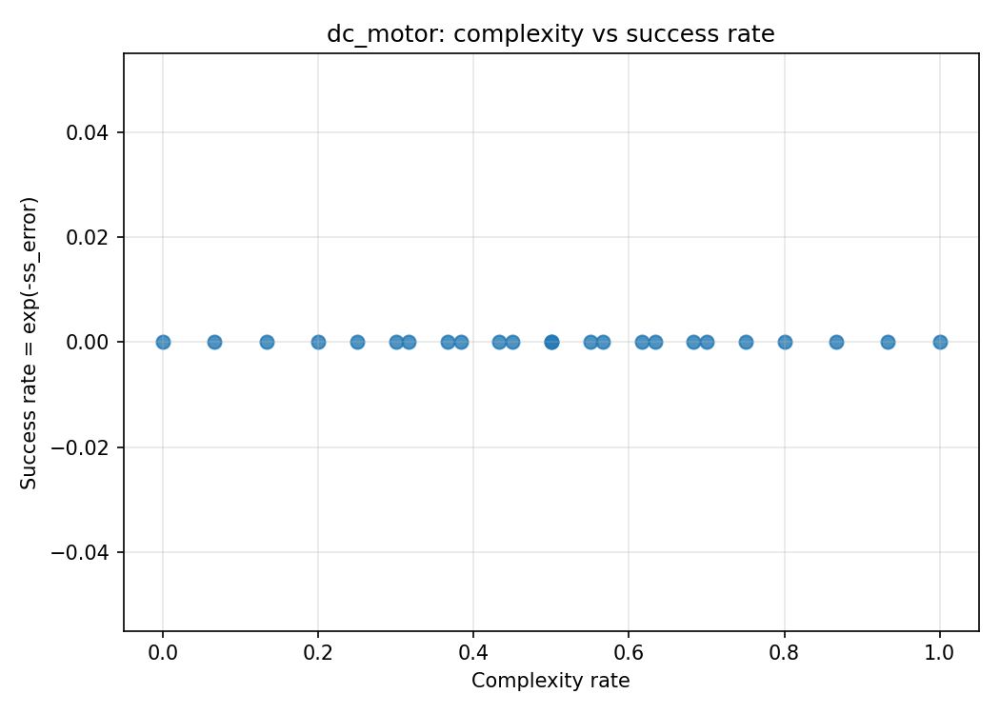
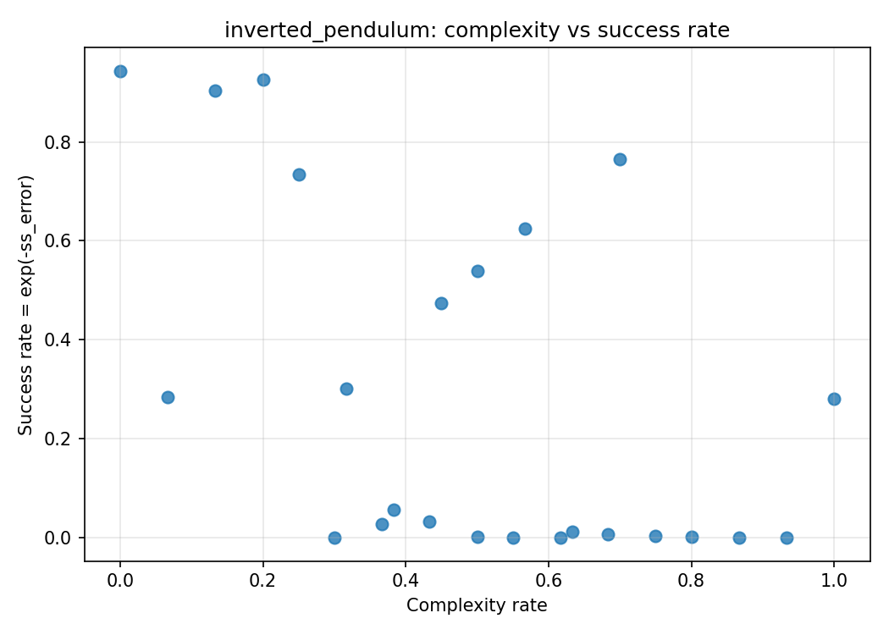
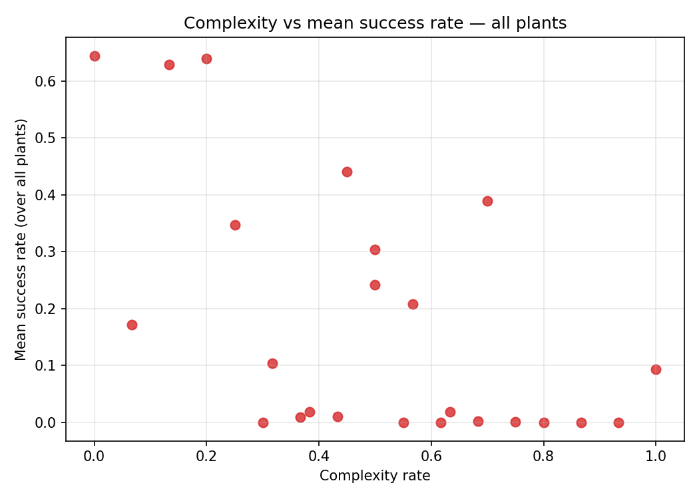
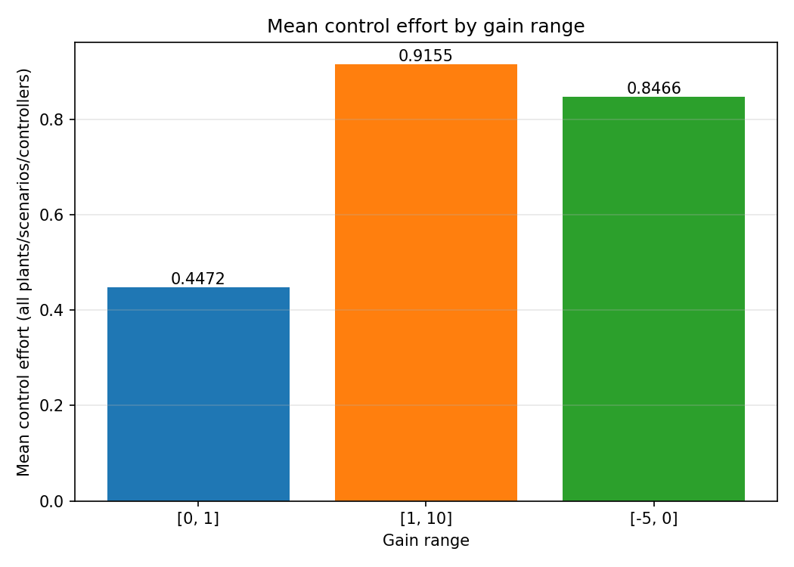

# Test Suite Progress Report
_Generated: 2026-08-18T21:41:18 · Wall time: 6.53s_

## Summary
- Passed: 49
- Failed: 0
- Skipped: 0
- XFailed (known gaps): 1
- XPassed: 0
- Pass rate: 100.0%

## Results by Category
| Category | Passed | Failed | Skipped | XFail |
|---|---|---|---|---|
| unit | 25 | 0 | 0 | 0 |
| simulate | 3 | 0 | 0 | 0 |
| design | 8 | 0 | 0 | 1 |
| randomness | 2 | 0 | 0 | 0 |
| failure | 8 | 0 | 0 | 0 |
| fixtures | 2 | 0 | 0 | 0 |
| scenario | 1 | 0 | 0 | 0 |

## Baseline Comparison
- Baseline: 2026-08-16T01:54:06
- Pass-rate delta: 0.0%

## Randomness Tests

### Same config, different seeds
Drives run_optimization on each built-in plant under a fixed 'medium' scenario (IC=[0.5, 0.5], randomness_level=0.5, disturbance_level=0.2) with PID, max_iter=5, over seeds [1, 7, 42, 100, 2026]. Last-iteration metrics are aggregated over all plants x seeds. success_rate = exp(-mean steady-state error) in (0, 1]; 1 means zero average steady-state error.

| Statistic | Value |
|---|---|
| Samples | 15 |
| MSE mean | 13.651191 |
| MSE variance | 1289.876165 |
| RMSE mean | 2.467808 |
| RMSE variance | 7.561114 |
| Steady-state error mean | 3.730118 |
| Steady-state error variance | 38.265456 |
| Success rate = exp(-mean SSE) | 0.02399 |

_Per-plant/seed raw metrics are in latest_report.json._

### Repeated runs (same seed)
Same 'medium' scenario, PID and max_iter=5, but a single fixed seed (42) run 5 times per plant; only the last run's metrics are recorded per plant (the design 'seed' does not reseed the mock agents' gain RNG, so repeats differ). Values aggregate the recorded last runs across the plants; statistics and success_rate are defined as in the different-seeds subsection.

| Statistic | Value |
|---|---|
| Samples | 3 |
| MSE mean | 10.090144 |
| MSE variance | 75.523234 |
| RMSE mean | 2.857713 |
| RMSE variance | 1.923619 |
| Steady-state error mean | 3.322054 |
| Steady-state error variance | 3.57628 |
| Success rate = exp(-mean SSE) | 0.036079 |

_Per-plant/seed raw metrics are in latest_report.json._

## Characterization Data (see latest_report.json)
- `test_scenarios`

## Scenario Complexity vs Success
Complexity rate = index-normalized, weighted blend of scenario (0.5), controller (0.2) and gain-range (0.3) difficulty; the [-5,0] gain range is excluded here (treated separately). Success rate = exp(-steady-state error).

### ball_beam: complexity vs success rate

### dc_motor: complexity vs success rate

### inverted_pendulum: complexity vs success rate

### All plants: complexity vs mean success rate

### Mean control effort by gain range

| Gain range | Mean control effort |
|---|---|
| [0, 1] | 0.447236 |
| [1, 10] | 0.915507 |
| [-5, 0] | 0.846604 |
